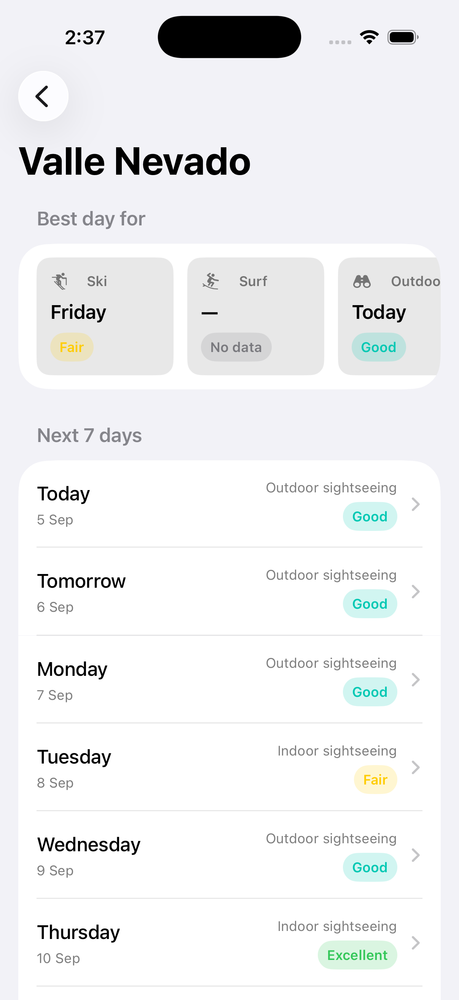
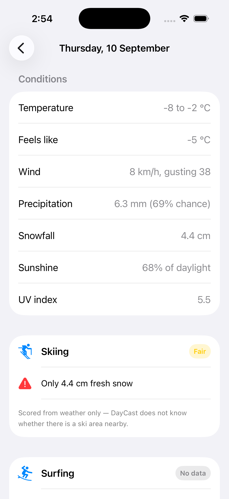

# DayCast

A native iOS app that searches for a city and ranks the next 7 days for **skiing**,
**surfing**, **outdoor sightseeing** and **indoor sightseeing** — scored from Open-Meteo
forecast data, with a plain-English reason for every score.

SwiftUI · Swift 6 language mode · Clean Architecture · Swift Testing · **zero third-party
dependencies**

---

## Screenshots

| Search | The week | Why this score | When it fails |
|---|---|---|---|
|  |  |  |  |

Note the second screen: surfing reads **No data**, not a bad score. Valle Nevado is in the
Andes, and the Marine API has nothing for it — so surfing degrades alone while skiing and
sightseeing still score. The retry button on the fourth appears because `AppError.offline`
says retrying could work; it would not appear for a decoding failure, where it cannot.

---

## Running it

```bash
open DayCast.xcodeproj      # Xcode 16+, iOS 18.0+ simulator
```

⌘R to run, ⌘U to test. No API keys, no package resolution, no setup — Open-Meteo needs no
authentication and the project has no dependencies.

```bash
xcodebuild test -project DayCast.xcodeproj -scheme DayCast \
  -destination 'platform=iOS Simulator,name=iPhone 17'
```

**138 tests.** Try **Valle Nevado** for a good ski week, **Biarritz** for real surf, and
**Prague** for an inland city where surfing correctly reports *no data* while everything
else still scores.

---

## What's actually interesting here

Fetching weather is not the problem. These are:

**Defining "suitable".** There is no correct ski score, so the model is invented, its
thresholds are named constants, and every score carries reasons generated in the domain.
The first version composed every factor as a weighted sum — and scored a 24 °C sunny day
**40/100 for skiing**, because it collected credit for "not raining" and "not windy" while
having no snow at all. Prerequisites are now *gates* that multiply the score rather than
factors that trade against it. → [`docs/03`](docs/03-Assumptions-and-Tradeoffs.md#21-the-scoring-model-was-structurally-broken-and-the-tests-all-passed)

**Partial failure.** Surfing needs wave data, which only exists on the coast. An inland city
returns `HTTP 200` with every value `null` — so a missing marine response degrades *surfing
alone* to "no coastal data" and must never fail the screen. That policy is the orchestration
that justifies a use-case layer.
→ [`docs/02` AD-6](docs/02-Architecture-Decisions.md#ad-6--the-partial-failure-policy-lives-in-the-use-case)

**Being honest about what the model cannot know.** Ski and surf scores read weather at the
city's coordinates; nothing in Open-Meteo says whether a mountain or a rideable beach is
nearby. The app says so on screen rather than only in a document.

---

## Architecture

```
Presentation  ───────►  Domain  ◄───────  Data
  SwiftUI views          pure Swift        Open-Meteo
  @Observable VMs        Foundation only   UserDefaults
  ViewState<T>           no frameworks
```

- `Domain` imports **nothing but `Foundation`** — enforced by a test that reads the source
  files and fails the build on a forbidden import, not by a diagram.
- ViewModels call use cases, never repositories. Repository *protocols* live in `Domain`,
  implementations in `Data`.
- State is a single `ViewState<T>` (`idle / loading / loaded / empty / failed`), so
  loading-*and*-failed is unrepresentable.
- Debounce and cancellation are both `.task(id:)`. No Combine.

Full reasoning, including the four places the textbook layering was deliberately **not**
followed: [`docs/02-Architecture-Decisions.md`](docs/02-Architecture-Decisions.md).

---

## Documentation

| | |
|---|---|
| [`01-Solution-Planning.md`](docs/01-Solution-Planning.md) | Problem framing, the questions I'd have asked a PM and what I assumed instead, scope cuts with reasons. Written **before** implementation and deliberately not revised. |
| [`02-Architecture-Decisions.md`](docs/02-Architecture-Decisions.md) | 15 decisions, each with what was rejected and what it **costs**. |
| [`03-Assumptions-and-Tradeoffs.md`](docs/03-Assumptions-and-Tradeoffs.md) | What the model assumes, **where the plan turned out to be wrong**, known limitations, how each definition-of-done criterion was verified, and what I'd do next. |
| [`04-AI-Usage.md`](docs/04-AI-Usage.md) | A dated log kept as the work happened — where AI output was wrong and how it was caught, where I overruled it and why. |
| [`CLAUDE.md`](CLAUDE.md) | The rules I held myself to, including what was considered and rejected. |

The commit history is meant to be read: one commit per phase, each on a green build.
